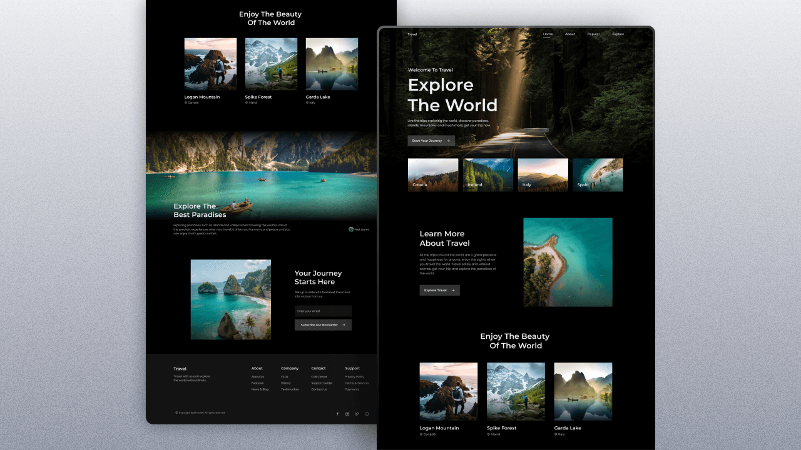

# Responsive Travel Landing Page

A modern, fully responsive travel website landing page built with HTML, CSS, and JavaScript. This project showcases a beautiful and interactive travel booking interface with smooth animations and a mobile-first design approach.

## 📸 Preview



## 🌟 Features

- **Fully Responsive Design** - Seamlessly adapts to all screen sizes (mobile, tablet, desktop)
- **Smooth Scroll Animations** - Scroll reveal animations for an engaging user experience
- **Mobile-First Methodology** - Built mobile-first, then optimized for larger screens
- **Smooth Navigation** - Smooth scrolling between sections with an interactive navigation menu
- **Modern UI/UX** - Clean, professional, and visually appealing interface
- **Fast Performance** - Optimized assets and minimal dependencies
- **Cross-Browser Compatible** - Works reliably across all modern browsers

## 🛠️ Technologies Used

- **HTML5** - Semantic markup structure
- **CSS3** - Modern styling with animations and responsive design
- **JavaScript (Vanilla)** - Interactive features and scroll animations
- **ScrollReveal** - Lightweight library for scroll animations

## 📋 Page Sections

- **Header & Navigation** - Logo and smooth navigation menu
- **Home** - Hero section with call-to-action and featured destinations
- **About** - Information about travel experiences
- **Popular** - Showcase of popular travel destinations
- **Explore** - Detailed exploration of travel paradises
- **Newsletter** - Email subscription section
- **Footer** - Links and footer information

## 🚀 Getting Started

### Prerequisites
- A modern web browser (Chrome, Firefox, Safari, Edge)
- No additional installations required

### Installation

1. Clone or download this repository:
```bash
git clone https://github.com/BS-Joy/travel_landingPage.git
cd travel_landingPage
```

2. Open the `index.html` file in your web browser:
   - Double-click `index.html`, or
   - Right-click and select "Open with" → your preferred browser

3. No build process or dependencies installation needed!

## 💻 Usage

Simply open `index.html` in your web browser. The website will:
- Display a fully responsive travel landing page
- Show scroll animations as you scroll through sections
- Provide smooth navigation between different sections
- Adapt automatically to your device screen size

## 📱 Browser Compatibility

- ✅ Chrome (latest versions)
- ✅ Firefox (latest versions)
- ✅ Safari (latest versions)
- ✅ Edge (latest versions)
- ✅ Mobile browsers (iOS Safari, Chrome Mobile)

## 🎯 Key Features Breakdown

### Responsive Design
- Mobile-optimized layout
- Flexible grid system
- Responsive images

### Smooth Animations
- CSS transitions and animations
- ScrollReveal effects on page sections
- Smooth page scrolling

### Interactive Navigation
- Hamburger menu for mobile devices
- Smooth scroll links
- Active link highlighting

## 📚 Credits

- **Based on**: Bedimcode Tutorial - [YouTube Channel](https://www.youtube.com/@Bedimcode)
- **Watch the Tutorial**: [Responsive Travel Website](https://youtu.be/cgV2tN8gxCg)
- **Icons**: [Remix Icon](https://remixicon.com/)

## 🤝 Contributing

Feel free to fork this project and customize it for your own needs!

---

**Note**: This is a responsive travel landing page designed to showcase web design and development skills. Customize the content, images, and styling to create your own unique travel website!
